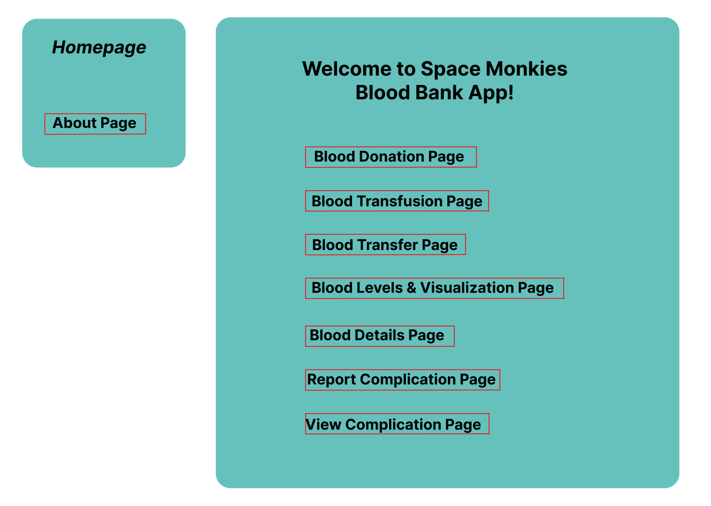
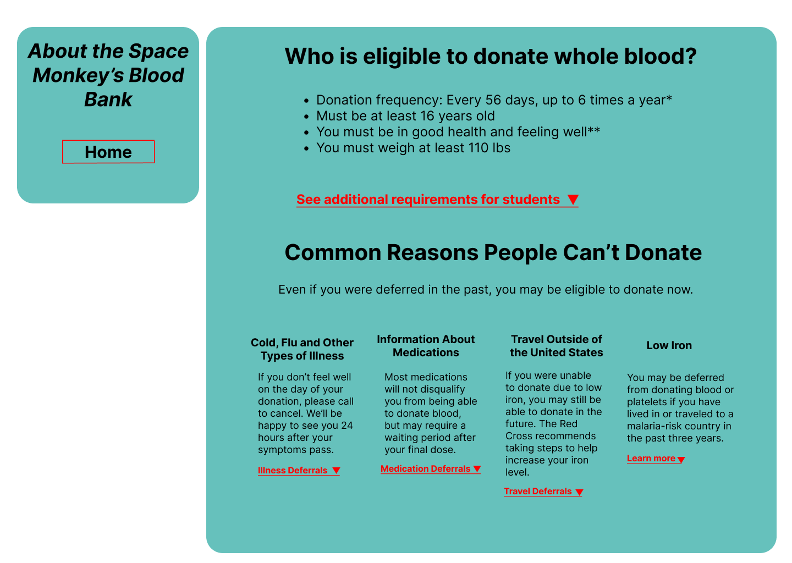
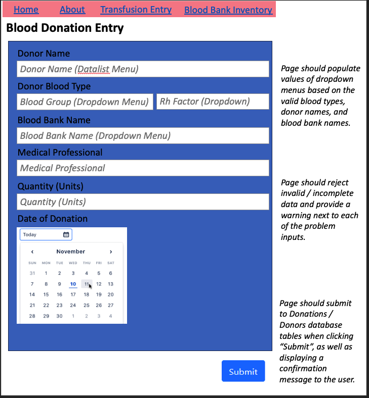
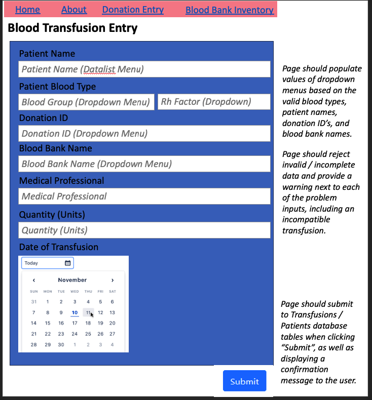
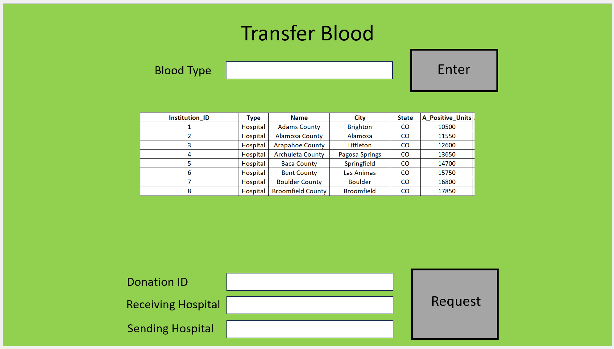
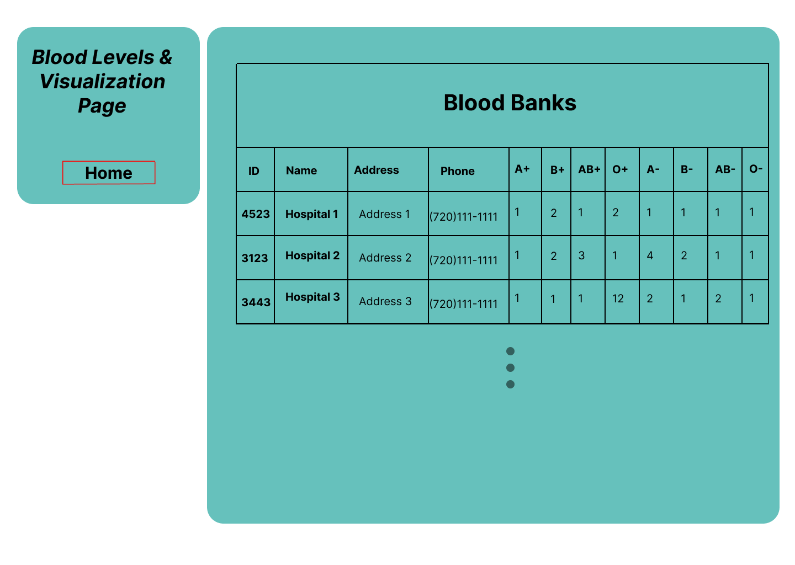
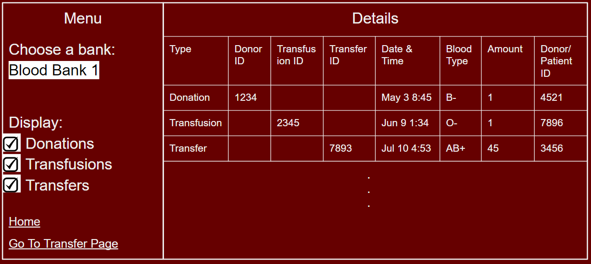

# CSPB 3308
# Group 2 - Space Monkeys
# Project Deliverable 4 - Web Pages Design

## Homepage

<figure width=100%>
  
</figure>

Page Description: 
- This page will welcome the user and thank them for being apart of this blood bank. Provide information on who is eligible to donate blood, provide facts and information. 

Parameters Needed: 
- None required.

Data Needed: 
- None required.

Link Destinations: 
- About Page
- blood donation page
- blood transfusion page
- blood transfer page
- blood levels and visualization page
- blood details page
- report complication page
- view complication page

List of Tests for Verifying the Rendering of the Page: 
- Verify that links from the homepage are rendered successfully.
- Verify that the menu is rendered.

## About Page

<figure width=100%>
  
</figure>

Page Description: 
- This page will welcome the user and thank them for being apart of this blood bank. Provide information on who is eligible to donate blood, provide facts and information. 

Parameters Needed: 
- None required.

Data Needed: 
- None required.

Link Destinations: 
- Homepage
 
List of Tests for Verifying the Rendering of the Page: 
- Verify that links to homepage are rendered successfully.
- Verify that the text on about page is rendered.

## Blood Donation Entry Page

#### Page Mockup:

<figure width=100%>
  
</figure>

#### Page Description:
    
- The user story that this webpage seeks to address is "As a hospital administrator, I want to enter a blood donation into the blood bank database, so that the blood is tracked and can be easily found when a patient needs a blood transfusion."
- The purpose of this webpage is to display an input form that the website user can use to enter a donation record into the Donations table in the database.
- As a secondary purpose, the user input data could also be used to enter a new donor into the Donors table if the donor is not currently in the Donors table.
- This information will then also be used to update (increment) the blood inventory stock for the hospital / blood bank that received the donation.
- As a stretch goal, an editing functionality may also be implemented on this webpage, for the user to correct an input error if they make one.
- The page should provide dropdowns for certain user input parameters (see below) to be able to validate the user input.
- The page should reject invalid input (including incomplete input - i.e. trying to submit the form without fully filling it out) and display a warning to the user in the case of invalid / incomplete input.
- The page should display a confirmation message to the user on successful entry of the donation after submission of the form.
    
#### Parameters needed for the page:
    
- The webpage should always display the same input form (assuming that the Donations table schema does not change). Therefore, parameters for the page will be the user input data to be able to enter the donation into the Donations table.
- User input required:
    - Donor name
    - Donor blood type
    - Blood bank name
    - Date of donation
    - Medical professional 
    - Quantity 
    
#### Data needed to render the page:
    
- In order to make the user input form as user friendly as possible (and to prevent invalid data input into the database), several of the user input sections will be dropdown menus where the user will select from a list of predefined options. The data required to populate these dropdown menus will be:
    - List of donor names in Donors table
    - List of possible blood types (A+, B+, AB+, O+, A-, B-, AB-, O-)
    - List of blood bank names
    
#### Link destinations for the page:
    
- The page does not require any specific links beyond the main navigation menu, which will link back to the homepage (and potentially directly to some of the other pages on this list (e.g. Blood Transfusion Entry Page)
    
#### List of tests for verifying the rendering of the page:
    
1. Verify that entry form is rendered correctly with all input boxes / dropdowns and text descriptions.
2. Verify that dropdown forms contain the correct choices.
3. Verify that the user cannot submit incomplete / invalid input, and that the correct warning message is displayed in this case.
4. Verify that the correct confirmation message is displayed when the user enters a valid donation.

## Blood Transfusion Entry Page

#### Page Mockup:

<figure width=100%>
  
</figure> 

#### Page Description:
    
- The user story that this webpage seeks to address is "As a hospital administrator, I want to record a blood transfusion in the blood bank database, so that the blood inventory is updated correctly and so we can track which donor a patient received blood from (in the case of any complications)."
- The purpose of this webpage is to display an input form that the website user can use to enter a transfusion record into the Transfusions table in the database.
- This information will then also be used to update (decrement) the blood inventory stock for the hospital / blood bank that provided the blood for the transfusion.
- As a stretch goal, an editing functionality may also be implemented on this webpage, for the user to correct an input error if they make one.
- The page should provide dropdowns for certain user input parameters (see below) to be able to validate the user input.
- The page should reject invalid input (including incomplete input - i.e. trying to submit the form without fully filling it out) and display a warning to the user in the case of invalid / incomplete input, including an incompatible transfusion.
- The page should display a confirmation message to the user on successful entry of the transfusion after submission of the form.
    
#### Parameters needed for the page:
    
- The webpage should always display the same input form (assuming that the Transfusions table schema does not change). Therefore, parameters for the page will be the user input data to be able to enter the transfusion into the Transfusions table.
- User input required:
    - Patient name
    - Patient blood type
    - Donation ID
    - Blood bank name
    - Date of transfusion
    - Medical professional 
    - Quantity 
    
#### Data needed to render the page:
    
- In order to make the user input form as user friendly as possible (and to prevent invalid data input into the database), several of the user input sections will be dropdown menus where the user will select from a list of predefined options. The data required to populate these dropdown menus will be:
    - List of patient names in Patients table
    - List of possible blood types (A+, B+, AB+, O+, A-, B-, AB-, O-)
    - List of blood bank names
    - List of Donation ID's
    
#### Link destinations for the page:
    
- The page does not require any specific links beyond the main navigation menu, which will link back to the homepage (and potentially directly to some of the other pages on this list (e.g. Blood Donation Entry Page)
    
#### List of tests for verifying the rendering of the page:
    
1. Verify that entry form is rendered correctly with all input boxes / dropdowns and text descriptions.
2. Verify that dropdown forms contain the correct choices.
3. Verify that the user cannot submit incomplete / invalid input, and that the correct warning message is displayed in this case.
4. Verify that the correct confirmation message is displayed when the user enters a valid transfusion.

## Blood Transfer Page
    
#### Page Mockup:

<figure width=100%>
  
</figure> 

#### Page Description:
    
- Allows user to see how much of a blood type there is in each hospital
    
#### Parameters needed for the page:
    
- Blood Type, Donation ID, Receiving Hospital ID, Sending Hospital ID
    
#### Data needed to render the page:
    
- Institution_ID, Type, Name, City, State, Available Units for Specific Blood Type
    
#### Link destinations for the page:
    
- Can get to the page via the main page -> donation, transfusion,  transfer blood page -> transfer blood link.
    
#### List of tests for verifying the rendering of the page:
    
1. Enter button/link correctly retrieves Banks and Hospitals Table for blood type specified
2. Request button/link correctly puts in transfer data

## Blood Levels and Visualization Page

<figure width=100%>
  
</figure>

Page Description: 
- This page will display all hospitals blood data in one visual.

Parameters Needed: 
- None required, optional parameters for choice sending blood?

Data Needed: 
- Bloodbanks_and_Hospitals, Donation, Transfusion, and Transfer tables from our database

Link Destinations: 
- Homepage
- Blood Transfer Page
- Blood Details Page
 
List of Tests for Verifying the Rendering of the Page: 
- Verify that more than one hospitals blood is accesible.
- Verify that the data for the default and all other hospitals are displayed correctly.

## Blood Details Page

Page Description: This page will display a detailed record of the donations, transfusions, and transfers of blood for one hospital/blood bank at a time. It will include a table which displays the data and a menu from which the user can select a hospital to view and select the types of data they would like to view in the table. 

<figure width=100%>
  
</figure>

Parameters needed: None required, optional parameters for choice of hospital/blood bank and data filters

Data needed: Bloodbanks_and_Hospitals, Donation, Transfusion, and Transfer tables from our database

Link destinations: Homepage, Transfer page

List of tests for verifying the rendering of the page:
- Verify that a hospital/blood bank is chosen by default
- Verify that the data for the default hospital is displayed correctly
- Verify that choosing another hospital displays the data for that hospital
- Verify that menu choices are reflected in the data displayed
- Verify that links to the homepage and transfer page are rendered
- Verify that the menu is rendered

## Report Complications Page

## View Complication Reports Page

